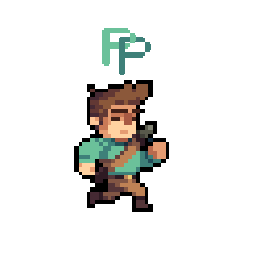

# PixiesPixel 

A cross-platform realtime online multiplayer PvP game made with [Godot](https://godotengine.org/).

**[Try it out](https://github.com/AaronCQL/PixiesPixel/releases/tag/v1.0.0-beta.1): executables for Windows, MacOS, Linux, and Android are available.**

## Instructions

Download the necessary files for your operating system (there is no need to install any other additional files/dependencies)

- To test **locally**:
  1) Launch two instances of the game on your machine (MacOS users might have to rename the other file), leave the default IP address as it is, host on one instance first, then join on the other
  
- To connect with players on the **same** Wifi network:
  1) To host a game: Simply press `host` and you should automatically be transported to the Lobby. Your private IPv4 address should also appear on the top left hand corner
  2) To join a game: Enter the host’s IPv4 address. Press `join`, and if connected successfully, you should be transported to the Lobby (the connection ought to be almost instant)

- To connect with players **outside** of your Wifi network:
  1) You will need to either set up [port forwarding](https://www.lifewire.com/how-to-port-forward-4163829) to allow your IP address to be publicly available to networks outside of your LAN
  2) Or use a Virtual Private Network on-demand client like [Hamachi](https://www.vpn.net/) to extend your LAN-like environment (recommended; tested and working)

## Naming Conventions
- **Classes/scenes/nodes**: pascal case <`MyScene`>  
- **Variables/functions**: snake case <`my_var`>  
- **Signals**: past tense <`door_opened`>  
- **Constants**: upper caps snake case <`MY_CONSTANT`>

<a href="https://docs.godotengine.org/en/3.1/getting_started/scripting/gdscript/gdscript_styleguide.html">Source</a>

## Warnings
**Do not** move/rename files using terminal/file explorer. Use Godot's inbuilt 
file system to move/rename files in order to not break the references.

## Credits
For the assets used (sprites/tilemaps/music/fonts):
- <a href="https://rvros.itch.io/animated-pixel-hero">Adventurer</a> character
- <a href="https://orlando-pixel.itch.io/pirate-bomb">Pirate</a> character
- <a href="https://szadiart.itch.io/hero-and-opponents-animation">Archer</a> character
- <a href="https://bakudas.itch.io/generic-dungeon-pack">Dungeon</a> map
- <a href="https://vnitti.itch.io/taiga-asset-pack">Grassy Plains</a> map
- All music by <a href="https://soundimage.org/sample-page/">Eric Matyas</a> of www.soundimage.org
- <a href="https://managore.itch.io/m5x7">m5x7</a> and <a href="https://datagoblin.itch.io/monogram">Monogram</a> fonts

> A copy of the original licenses/permissions from the authors (if applicable) can also be found in the respective subdirectories of the `/Assets` directory.

## License
Unless otherwise stated, all `GDScript` code written for this project is licensed under the MIT License. For the licenses regarding the assets used, please refer to the appropriate subdirectories within the `/Assets` directory for a copy of the original license/permissions (if applicable).
